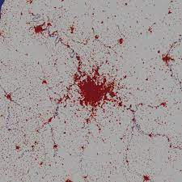
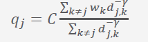
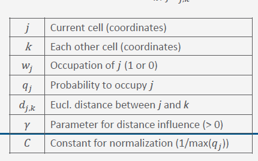

 
  

# GeoSim - Distance-weighted city growth
#### <a href ="https://github.com/IgorQuaresma">Igor Quaresma</a>, <a href ="https://github.com/andre-kotze">Andre Kotze</a>, <a href ="https://github.com/kardwen">Felix Schewe</a>, <a href ="https://github.com/merelvogel">Merel Vogel</a>

## Research Question

  The goal of this project will be to reproduce Figure 1a-f of Rybski, Garciá and Kropp (2013). This leads to the following research question: Which percentual differences emerge in the output of Rybski et al.’s model (2013) when using different values for the gamma (γ) exponent? 

 
  

## Conceptual Model

  The model is a cellular automaton, and each cell can be either empty (0) or occupied (1). Occupied in this case means that it is part of an urban area. The model then is initiated by starting with an empty grid of size N x N, and by having a single central cell as occupied. The central cell location is at (N/2, N/2). The transition function is defined by the probability that a cell will be occupied, which is described as follows, 
  where:  
  
So essentially, the probability of a cell becoming part of the city is solely determined by the weighted sum of the Euclidean distance to all the other cells. Taking into account the first law of geography, the model assumes that the closer a cell is to a city, the more likely it is to turn into a city itself. The weight per grid cell is represented by the exponent gamma, the effects of which we will study in this project. 

## Task Division
- Write set-up (all)
- Set up GitHub repo (Igor)
- Read the paper (all)
- Write the code
  - set up empty grid of size 630 x 630 
  - assign value 1 to central grid cell
  - implement transition function based on the equation above
    - implement euclidean distance function
    - implement other probability function elements
  - implement no. of realizations
  - implement time steps
  - run the model for different exponent values: 2.0, 2.5, 3.0
  - determine percentual differences between each output (i.e. how much more space is occupied)
- Compare results to original figure in the paper
- Determine differences
- Prepare presentation (all)
  - introduction + research question
  - short methodology + conceptual model
  - results
  - comparison with results in the paper
  - discussion and conclusion
  - references

## Time Planning
t | p
--- | ---
Week 1 | - Understand paper - Complete project set-up
Week 2 | - Start implementing model - Run for different exponent values
Week 3 | - Buffer-time model implementation - Prepare presentation

## Activities and Resources

